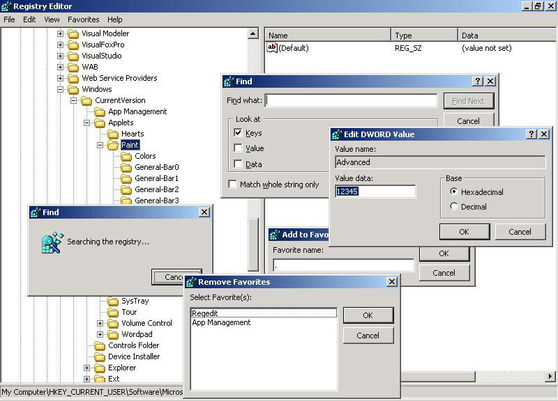



## RegEdit 2\.0 BETA

### Description

some functions already completed but not of all.

I'll write about sync. for all client in a lan (useful for personal internet services): sync -&gt; desktop, games, registry (some games need this info), file(s) (games can update offline by my program), lock pc (disable run, change wallpaper, copy file, delete file,...)

ALL IN ONE PROGRAM!
 
### More Info
 

             |
---                |---
**Submitted On**   |2007-02-13 18:12:30
**By**             |[sowLov](https://github.com/Planet-Source-Code/PSCIndex/blob/master/ByAuthor/sowlov.md)
**Level**          |Advanced
**User Rating**    |4.8 (19 globes from 4 users)
**Compatibility**  |VB 6\.0
**Category**       |[Registry](https://github.com/Planet-Source-Code/PSCIndex/blob/master/ByCategory/registry__1-36.md)
**World**          |[Visual Basic](https://github.com/Planet-Source-Code/PSCIndex/blob/master/ByWorld/visual-basic.md)
**Archive File**   |[RegEdit\_2\_2049892242007\.zip](https://github.com/Planet-Source-Code/sowlov-regedit-2-0-beta__1-67968/archive/master.zip)

